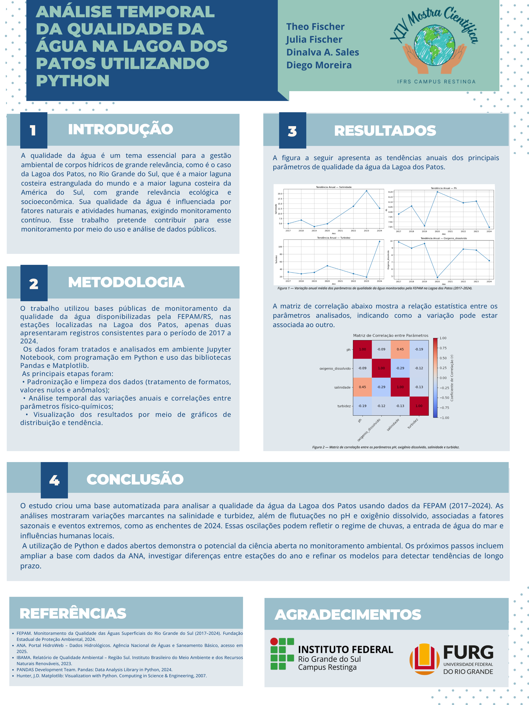

# Mostra Científica — Análise da Qualidade da Água da Lagoa dos Patos

  

  <em>Banner apresentado na Mostra Científica, com resultados do estágio sobre análise temporal da qualidade da água da Lagoa dos Patos.</em>

Este documento registra a forma como os resultados do estágio foram organizados para apresentação em formato de banner científico.

A apresentação teve como foco mostrar, de maneira visual e resumida, como dados públicos e ferramentas computacionais podem ser usados para apoiar o monitoramento ambiental da Lagoa dos Patos.

---

## 1. Tema da apresentação

O tema apresentado foi a análise da qualidade da água da Lagoa dos Patos, utilizando dados públicos da FEPAM e ferramentas de ciência de dados em Python.

A proposta foi transformar dados ambientais em informações mais compreensíveis por meio de limpeza, organização, gráficos e análise exploratória.

---

## 2. Objetivo

O objetivo da apresentação foi demonstrar como Python, pandas e Matplotlib podem ser utilizados para analisar parâmetros físico-químicos da água da Lagoa dos Patos.

O trabalho buscou observar variações em parâmetros como:

- pH;
- oxigênio dissolvido;
- salinidade;
- turbidez;
- transparência da água.

---

## 3. Metodologia apresentada

O trabalho utilizou bases públicas de monitoramento da qualidade da água disponibilizadas pela FEPAM/RS, com foco em estações associadas à Lagoa dos Patos.

Os dados foram tratados e analisados em ambiente Jupyter Notebook, com programação em Python e uso das bibliotecas pandas e Matplotlib.

As principais etapas foram:

- busca e organização dos dados;
- leitura de arquivos CSV e XLS;
- limpeza e padronização das bases;
- filtragem de estações ligadas à Lagoa dos Patos;
- cálculo de estatísticas descritivas;
- análise de médias anuais;
- criação de gráficos de tendência;
- construção de matriz de correlação;
- interpretação exploratória dos resultados.

---

## 4. Resultados apresentados

As análises indicaram que os dados apresentavam comportamento compatível com um ambiente lagunar/estuarino.

Entre os principais pontos observados:

- o pH se manteve em faixa levemente alcalina;
- o oxigênio dissolvido variou dentro de faixas plausíveis;
- a salinidade apresentou variações entre os anos;
- a turbidez mostrou forte oscilação;
- em 2024, foram observadas alterações mais marcantes, possivelmente relacionadas às enchentes no Rio Grande do Sul;
- a transparência apresentou relação esperada com a turbidez;
- a matriz de correlação ajudou a observar relações entre parâmetros, sem indicar causalidade direta.

---

## 5. Conclusão apresentada

O estudo consolidou uma base inicial para análise da qualidade da água da Lagoa dos Patos a partir de dados públicos da FEPAM.

Os resultados indicaram padrões compatíveis com as características do ecossistema lagunar, mas também mostraram variações bruscas em alguns períodos, especialmente em parâmetros como turbidez e salinidade.

As oscilações observadas podem estar relacionadas ao regime de chuvas, à entrada de água do mar, à influência de eventos extremos e a impactos humanos locais.

A utilização de Python e dados abertos reforça a importância da ciência aberta e das ferramentas computacionais no monitoramento ambiental.

---

## 6. Limitações discutidas

A apresentação também reconheceu limitações importantes:

- número reduzido de estações diretamente associadas à Lagoa dos Patos;
- dados incompletos em alguns períodos;
- ausência de variáveis biológicas, como nutrientes, algas e coliformes;
- dificuldade de comparar parâmetros com unidades diferentes;
- necessidade de aprofundar a análise com mais bases e estações.

---

## 7. Possíveis continuações

Como próximos passos, foram considerados:

- integrar novas bases da ANA/RNQA;
- ampliar o número de estações analisadas;
- investigar diferenças sazonais;
- avaliar melhor os impactos das enchentes de 2024;
- incluir dados climáticos, como chuva e vazão;
- gerar visualizações mais completas e reprodutíveis.
